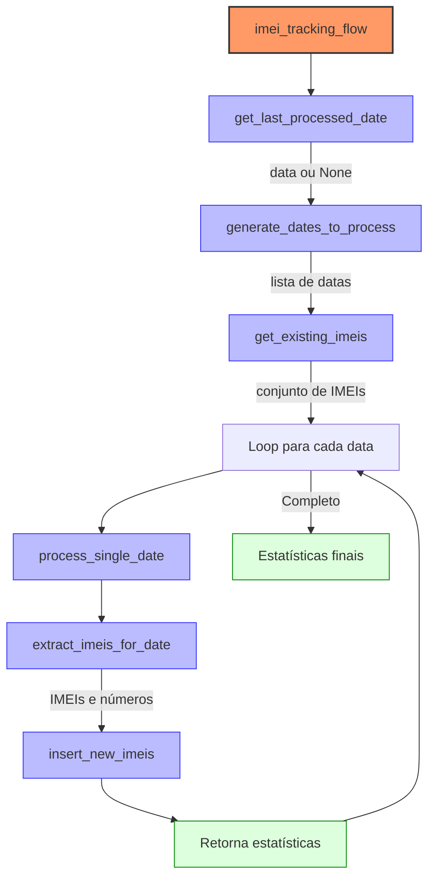

# Fluxo de Rastreamento de IMEI

## Visão Geral

Este fluxo automatiza a coleta, processamento e armazenamento de dados de IMEI (International Mobile Equipment Identity) com seus respectivos números de telefone. O fluxo foi projetado para identificar e registrar quais números de telefone estão associados a quais dispositivos (IMEI) com base nos registros de chamadas (CDR - Call Detail Records).

## Arquitetura

O fluxo segue uma arquitetura ETL (Extract, Transform, Load) típica:

1. **Extract**: Extração de dados de registros de chamadas de uma base MongoDB
2. **Transform**: Processamento para identificar os IMEIs únicos e associá-los aos números com maior tempo de uso
3. **Load**: Carregamento dos dados processados em um banco SQL Server

## Funcionalidades Principais

- Rastreamento inteligente de datas - processa apenas as datas necessárias
- Detecção automática de primeira execução ou execução de recuperação
- Armazenamento de estado para retomar processamento
- Suporte para reset completo do processamento mensal
- Agrupamento de IMEIs por número de telefone com maior tempo de uso

## Fluxo de Execução

### Diagrama do Fluxo



## Detalhes Técnicos

### Tasks Principais

#### `get_last_processed_date`
- **Função**: Consulta o SQL Server para determinar a última data processada
- **Retorno**: String no formato 'YYYY-MM-DD' ou None se primeira execução
- **Fonte de dados**: Tabela `[dbo].[f_imei]` no SQL Server

#### `generate_dates_to_process`
- **Função**: Determina quais datas precisam ser processadas
- **Lógica**:
  - **Primeira execução**: Processa desde o início do mês atual até ontem
  - **Execução normal**: Processa desde o último dia processado até ontem
- **Retorno**: Lista de strings de datas no formato 'YYYY-MM-DD'

#### `extract_imeis_for_date`
- **Função**: Extrai IMEIs e seus números associados para uma data específica
- **Lógica de processamento**:
  - Agrupa por IMEI e número de telefone
  - Calcula duração total de chamadas para cada par
  - Para cada IMEI, seleciona o número com maior duração total
- **Fonte de dados**: Coleção `cdr` no MongoDB
- **Cache**: Implementa cache para evitar reprocessamento desnecessário

#### `insert_new_imeis`
- **Função**: Insere novos registros de IMEI no SQL Server
- **Recursos**:
  - Processamento em lote (batch)
  - Transações para garantir consistência
  - Tratamento de erros com rollback

### Dependências

- **Bancos de dados**:
  - MongoDB (fonte de dados - CDRs)
  - SQL Server (destino - tabela f_imei)
- **Bibliotecas**:
  - `prefect`: Orquestração do fluxo
  - `pendulum`: Manipulação avançada de datas
  - `pymongo`: Conexão com MongoDB
  - `pyodbc`: Conexão com SQL Server

### Configuração

O fluxo usa blocos Prefect para configuração:

- `mongodb-imei`: Configuração de conexão com MongoDB
- `sql-server-dmk`: Configuração de conexão com SQL Server

## Uso

### Execução Manual

```bash
prefect deployment run 'imei_tracking_flow/IMEI Device Inventory'
```

### Execução com Reset de Estado

```bash
prefect deployment run 'imei_tracking_flow/IMEI Device Inventory' -p reset=true
```

### Personalização

Para personalizar o comportamento, você pode passar parâmetros:

- `reset=true`: Reprocessa desde o início do mês atual

## Agendamento

O fluxo está configurado para executar diariamente às 6h da manhã no fuso horário de Cabo Verde (Atlantic/Cape_Verde).

## Monitoramento

Os logs do fluxo incluem informações detalhadas sobre:
- Datas sendo processadas
- Quantidade de IMEIs encontrados por data
- Novos IMEIs inseridos no banco
- Estatísticas de resumo ao final da execução

## Solução de Problemas

### Problemas Comuns

1. **Sem novas datas para processar**
   - Causa: O fluxo já processou todas as datas até ontem
   - Solução: Verifique se a última data processada está correta na tabela f_imei

2. **Falha na conexão com MongoDB**
   - Causa: Problemas de rede ou credenciais incorretas
   - Solução: Verifique as configurações no bloco mongodb-imei

3. **Falha na conexão com SQL Server**
   - Causa: Problemas de rede ou credenciais incorretas
   - Solução: Verifique as configurações no bloco sql-server-dmk

4. **Erros na inserção em lote**
   - Causa: Problemas de schema ou restrições de dados
   - Solução: Verifique os logs detalhados para identificar registros problemáticos

## Desenvolvimento Futuro

Ideias para melhorias futuras:

- Implementar paralelização para processar múltiplas datas simultaneamente
- Adicionar análise estatística de dispositivos por operadora
- Criar visualizações de dados no Prefect para monitorar tendências
- Implementar detecção de troca de SIM (mesmo IMEI com diferentes números)